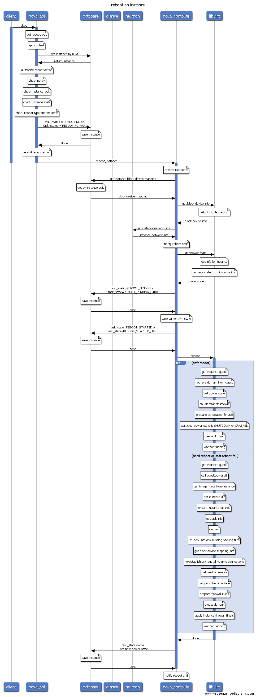
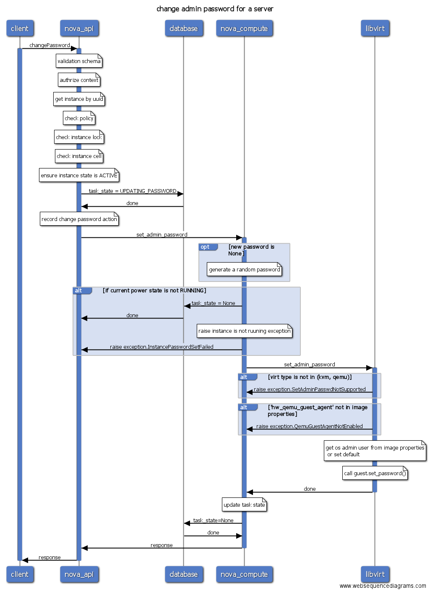

[👉English](./README.md)

# Openstack 操作序列图

本项目使用[在线绘图工具](https://www.websequencediagrams.com/)生成Openstack操作序列图. 通过操作序列图能快速追踪Openstack操作流程，希望对初学者学习Openstack有一点帮助，运维人员也能根据操作序列图进行故障排查.
注意，该操作序列图是根据L版Openstack源码画的，未来版本的操作可能会有变更,请以最新版的源码为准，该项目提供的序列图仅供参考。

## 操作列表

### 1. 虚拟机管理

- [x] [启动虚拟机](https://raw.githubusercontent.com/int32bit/openstack-workflow/master/output/nova/create.png)
- [x] [开机](https://raw.githubusercontent.com/int32bit/openstack-workflow/master/output/nova/start.png)
- [x] [关机](https://raw.githubusercontent.com/int32bit/openstack-workflow/master/output/nova/stop.png)
- [x] [重启](https://raw.githubusercontent.com/int32bit/openstack-workflow/master/output/nova/reboot.png)
- [x] [重建](https://raw.githubusercontent.com/int32bit/openstack-workflow/master/output/nova/rebuild.png)
- [x] [扩容(修改Flavor配置)](https://raw.githubusercontent.com/int32bit/openstack-workflow/master/output/nova/resize.png)
- [x] [打印虚拟机列表](https://raw.githubusercontent.com/int32bit/openstack-workflow/master/output/nova/list.png)
- [x] [删除虚拟机](https://raw.githubusercontent.com/int32bit/openstack-workflow/master/output/nova/delete.png)
- [x] [重置状态](https://raw.githubusercontent.com/int32bit/openstack-workflow/master/output/nova/reset_state.png)
- [x] [创建快照](https://raw.githubusercontent.com/int32bit/openstack-workflow/master/output/nova/snapshot.png)
- [x] [修改管理员密码](https://raw.githubusercontent.com/int32bit/openstack-workflow/master/output/nova/changePassword.png)
- [x] [疏散迁移](https://raw.githubusercontent.com/int32bit/openstack-workflow/master/output/nova/evacuate.png)
- [x] [停止虚拟机](https://raw.githubusercontent.com/int32bit/openstack-workflow/master/output/nova/pause.png)
- [x] [从pause的虚拟机恢复](https://raw.githubusercontent.com/int32bit/openstack-workflow/master/output/nova/unpause.png)
- [x] [挂起虚拟机](https://raw.githubusercontent.com/int32bit/openstack-workflow/master/output/nova/suspend.png)
- [x] [恢复虚拟机](https://raw.githubusercontent.com/int32bit/openstack-workflow/master/output/nova/resume.png)
- [x] [重置网络](https://raw.githubusercontent.com/int32bit/openstack-workflow/master/output/nova/reset_network.png)
- [x] [冷迁移](https://raw.githubusercontent.com/int32bit/openstack-workflow/master/output/nova/migrate.png)
- [x] [在线迁移](https://raw.githubusercontent.com/int32bit/openstack-workflow/master/output/nova/live_migrate.png)
- [x] [Shelve](https://raw.githubusercontent.com/int32bit/openstack-workflow/master/output/nova/shelve.png)
- [x] [Shelve-offload](https://raw.githubusercontent.com/int32bit/openstack-workflow/master/output/nova/shelve_offload.png)
- [x] [Unshelve](https://raw.githubusercontent.com/int32bit/openstack-workflow/master/output/nova/unshelve.png)
- [x] [锁定虚拟机](https://raw.githubusercontent.com/int32bit/openstack-workflow/master/output/nova/lock.png)
- [x] [解锁虚拟机](https://raw.githubusercontent.com/int32bit/openstack-workflow/master/output/nova/unlock.png)
- [x] [定时备份虚拟机](https://raw.githubusercontent.com/int32bit/openstack-workflow/master/output/nova/backup.png)
- [x] [Refresh Network](https://raw.githubusercontent.com/int32bit/openstack-workflow/master/output/nova/reset_network.png)
- [x] [重命名虚拟机](https://raw.githubusercontent.com/int32bit/openstack-workflow/master/output/nova/rename.png)
- [x] [拯救模式](https://raw.githubusercontent.com/int32bit/openstack-workflow/master/output/nova/rescue.png)
- [x] [Unrescue](https://raw.githubusercontent.com/int32bit/openstack-workflow/master/output/nova/unrescue.png)
- [x] [挂载volume](https://raw.githubusercontent.com/int32bit/openstack-workflow/master/output/nova/volume_attach.png)
- [x] [卸载volume](https://raw.githubusercontent.com/int32bit/openstack-workflow/master/output/nova/volume-detach.png)
- [x] [挂载网卡](https://raw.githubusercontent.com/int32bit/openstack-workflow/master/output/nova/interface-attach.png)
- [x] [卸载网卡](https://raw.githubusercontent.com/int32bit/openstack-workflow/master/output/nova/interface-detach.png)


### 2. Todo列表

- [ ] Cinder
- [ ] Neutron
- [ ] Sahara

    * - [x] [创建集群](https://raw.githubusercontent.com/int32bit/openstack-workflow/master/output/sahara/create_cluster.png)


- [ ] Magnum
- [ ] ...

## 快速开始


### 1. 生成图片

生成最新图片需要连接外网并且依赖于Make工具，请确保所依赖的包已经安装。

```
make
```

生成的图片默认会保存在`./output`路径下.

### 2. 清理图片

执行以下命令可清理所有的图片:

```
make clean
```

## 操作流程案例分析

注意: 

* 图中蓝色线表示当前进程是active的，因此可以很容易看出是RPC同步调用还是异步调用的。
* Nova conductor配置use_local为false，访问数据库需要通过RPC调用conductor，但图中为了方便表示数据库操作，省略了RPC调用conductor访问数据库的过程。实际上Nova已经完全使用objects模型封装了数据库操作,代码位于`nova/objects`目录。

### 1. 创建虚拟机


从操作序列图看，虚拟机的创建主要分为三步：第一步是nova api对用户创建虚拟机的参数进行检查，如果参数没有问题，nova api会在数据库中创建相应的表项用来记录用户的请求，然后给nova-conductor发起一个异步RPC调用，conductor会对调度时的filters spect进行初始化，并向nova-scheduler发起RPC同步调用， Nova-scheduler收到nova conductor发来的请求之后筛选能够满足虚拟机资源需求的hypervisor，并按照一定的策略选取其中的一台hypervisor，返回给nova-conductor，conductor然后给候选的计算节点nova compute发起一个run_instance的RPC调用。 Nova compute收到run_instance的请求之后，会为虚拟机的运行分配各种资源，如：ip地址、磁盘、网络等。分配完各种资源之后，nova会调用libvirt创建根磁盘、xml文件等,并启动虚拟机。到此，虚拟机的创建基本上就结束了，等虚拟机启动完成，用户就可以登录和控制虚拟机了。

### 2. 重启虚拟机

Nova中reboot操作可以分成两种：soft reboot和hard reboot。Soft reboot通过发送reboot acpid或者guest agent信号给虚拟机,虚拟机接收到信号号主动重启。虚拟机必须支持appid或者运行qemu guest agent才能执行soft reboot。若soft reboot失败或者超时(默认120秒)，则会进入hard reboot。hard reboot即执行强制重启（相当于强制切电源），虚拟机重启的序列图如下：



从上图可以看出，soft reboot和hard reboot最主要的差别是libvirt所执行的操作不同，soft reboot关机时执行shutdown操作，而hard reboot执行destroy操作，可能导致正在运行的虚拟机异常关机导致数据丢失。

### 3. 修改管理员密码



从上图中看出，修改管理员密码是通过libvirt调用qemu guest agent执行的，因此虚拟机必须安装了qemu-guest-agent服务并且处于运行状态。

注意L版修改管理员密码只支持使用kvm/qemu hypervisor。

### 4. 在线迁移

Live migrate是在不停止虚拟机的情况下，将虚拟机从一台宿主机上迁移到另外一台宿主机。在线迁移操作序列图如下：


在线迁移相对复杂，不过从图中看还是比较清晰的。如果不使用共享存储，传输虚拟机磁盘会花很长一段时间，导致虚拟机迁移很慢，因此建议使用统一共享分布式存储做Openstack存储后端。
在线迁移会不断的增量同步内存状态信息，直到收敛到很小的变化时，虚拟机会freeze一段时间，即处于downtime状态，完成最后的状态同步。迁移完成后，原来的虚拟机会自动删除。

## 更多的操作序列图?

阅读源代码并使用[Websequence Diagrams Tool](https://www.websequencediagrams.com/)语法编写脚本，比如:

```
title pause a server

participant client
participant nova_api

client->nova_api: pause
activate client
activate nova_api

# nova/api/openstack/compute/pause_server.py _pause()
note over nova_api: authrize context
nova_api->database: get instance by uuid
database->nova_api: done

# nova/compute/api.py pause()
note over nova_api: check policy
note over nova_api: check instance lock
note over nova_api: check instance cell
note over nova_api: ensure instance state is ACTIVE
nova_api->database: task_state = PAUSING
database->nova_api: done

note over nova_api: record pause action
# nova/compute/rpcapi.py pause_instance()
nova_api->nova_compute: pause_instance
deactivate nova_api
deactivate client
activate nova_compute

# nova/compute/manager.py pause_instance()
note over nova_compute: notify: pause.start
nova_compute->libvirt: pause
activate libvirt

# nova/virt/libvirt/driver.py pause()
note over libvirt: get domain
note over libvirt: domain.suspend()
libvirt->nova_compute: done
deactivate libvirt
# nova/compute/manager.py pause_instance()
nova_compute->database: vm_state = vm_states.PAUSED\ntask_state = None
database->nova_compute: done
note over nova_compute: notify: pause.end
deactivate nova_compute
```

## 贡献列表

以下这些人参与了该项目开发:

* AndiaQ
* int32bit
* ljjjustin

感谢你们! (如果我遗忘了你的名字，请提醒我)

## 附: Openstack支持的虚拟机操作列表

* boot: 创建一个新的虚拟机。
* delete: 删除虚拟机。
* force-delete: 不考虑虚拟机状态，强制删除。
* list: 打印当前租户虚拟机列表。
* show: 查看指定虚拟机的详细信息。
* stop: 关机虚拟机。
* start: 开机虚拟机。
* reboot: 重启虚拟机。
* migrate: 冷迁移虚拟机，迁移过程中虚拟机将关机。
* live-migrate: 在线迁移虚拟机，虚拟机不会关机。
* resize: 修改虚拟机配置，即使用新的flavor重建虚拟机。
* rebuild: 重建虚拟机，指定新的image，如果指定快照，则相当于虚拟机状态回滚。
* evacuate: 疏散迁移，只有当compute服务down时执行，能够迁移虚拟机到其它正常计算节点中。
* reset-state: 手动重置虚拟机状态为error或者active。
* create-image: 创建虚拟机快照。
* backup: 定期创建虚拟机快照。
* volume-attach: 挂载volume卷。
* volume-detach: 卸载volume卷。
* lock/unlock: 锁定虚拟机，锁定后的虚拟机普通用户不能执行删除、关机等操作。
* set-password: 修改管理员密码，虚拟机需要运行qemu guest agent服务。
* pause/unpause: 暂停运行的虚拟机，如果底层的虚拟化使用的是libvirt，那么libvirt会在将虚拟机的信息保存到内存中，KVM/QEMU进程仍然在运行，只是暂停执行虚拟机的指令。
* suspend/resume: 挂起虚拟机，将虚拟机内存中的信息保存到磁盘上，虚拟机对于的KVM/QEMU进程会终止掉，该操作对应于libvirt中的save操作。resume从挂起的虚拟机恢复。
* reset-network: 重置虚拟机网络，在使用libvirt时，该操作不执行任何实际的动作，因此功能尚未实现。
* shelve/unshelve: 虚拟机关机后仍占用资源，如果虚拟机长期不使用，可以执行shelve操作，该操作先创建虚拟机快照，然后删除虚拟机，恢复时从快照中重建虚拟机。
* rename: 重命名虚拟机, 后期版本将被update操作替代。
* update: 修改虚拟机名称、description信息等。
* rescue/unrescue: 虚拟机进入拯救模式。原理是创建一个新的虚拟机，并把需要rescue的虚拟机的根磁盘作为第二块硬盘挂载到新创建的虚拟机。当原虚拟机根磁盘破坏不能启动时该操作非常有用。
* interface-attach/interface-dettach: 绑定/解绑网卡。
* trigger-crash-dump: 使虚拟机触发crash dump错误，测试使用。
* resize-confirm: 确认resize操作，此时原来的虚拟机将被删除, 通常配置为自动确认。
* resize-revert: 撤销resize操作，新创建的虚拟机删除，并使用原来的虚拟机。
* console-log: 查看虚拟机日志。
* get-vnc-console: 获取虚拟机vnc地址, 通常使用novnc协议。

## 协议

MIT
